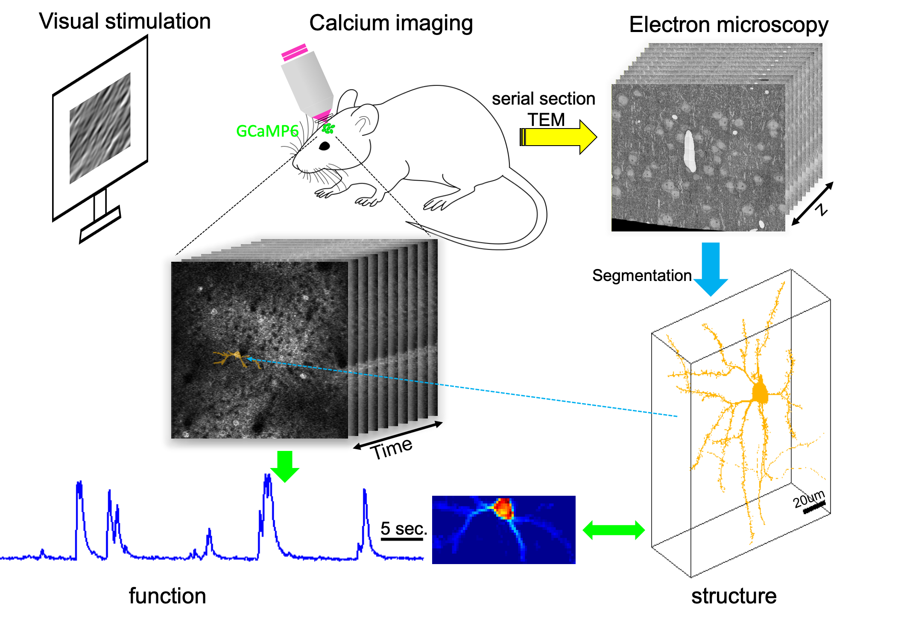

# EASE project 



This project includes all my work relating to the development of **EASE: EM-Assisted Sources Extraction** for calcium imaging data. This project was originally started for the support of analyzing data collected for [MICrONs](https://www.iarpa.gov/index.php/research-programs/microns) project. 

The goal here is to automatically extract neurons and their activity from calcium imaging data, and simutaneously match them with the segmented **electron microscopy (EM)** components. 

## Reproduce the whole research
The code below has been tested on a computer running Ubuntu 16.04. It should work fine on Mac OSX too.  
### step 0: clone the repository in terminal 
```bash 
git clone https://github.com/zhoupc/ease_project.git
cd ease_project
```

### step 1: install the required softwares 
* install [F-image](https://github.com/zhoupc/F-image) 
* use F-image to install all packages required by this project 
  ```matlab 
  % matlab command window 
  >>fi.usepkg({'yaml', ...  % load YAML files 
    'utils',...           % matlab util functions 
    'idl', ...            % easy access to scientific imaging data 
    'oasis',...           % deconvolve and denoise temporal activity 
    'datajoint', ...      % provide easy access to database 
    'ease'});             % core software: EASE 
  ```
* [install mysql](https://dev.mysql.com/doc/refman/8.0/en/installing.html) and [add users](https://docs.datajoint.io/matlab/admin/3-accounts.html). You also need to test your datajoint connection with MySQL. see details [here](https://docs.datajoint.io/matlab/admin/Admin.html)

### step 2: download data used for the paper
to be added. 

  [Download files to folder ./data/](https://www.dropbox.com/sh/ajfol2zcmxlahvy/AADL6PYxsyHxT2z9vZPMNyUNa?dl=0)
### step 3: generate all subfigures/videos for the paper in MATLAB 
```matlab 
%% matlab command window 
>> fi.usepkg('ease')
>> run_ease; 

%% Figure 1: graph abstract
>> run scripts/pinky40/graph_abstract/main.m 

%% Figure 2: EM features 
>> run scripts/pinky40/em_features/main.m 

%% Figure 3-6; Video S1; Video S2 
>> run scripts/pinky40/one_scan/main.m  % EASE will open a GUI automatically for you do do some manual intervention. it's mainly about verifying good matches, labeling components as soma or dendrite, find false positives 
% Video S1: Videos/pinky40/demixing_scan_1_201_9100.avi 
% Video S2: Videos/pinky40/demixing_example.avi 

%% Figure 7 
>> run scripts/pinky40/all_scans/main.m 

%% Figure 8 
>> run scripts/pinky40/compare_cnmf/main.m 

%% Figure 9: initialization 
>> run scripts/pinky40/initialization/main.m 
```

### step 4: compile tex files to create figures for the paper. 
The above matlab commands creates all subfigures for the paper. We need to combine them together for each figure in the paper. Run the following scripts in terminal 
```bash 
# change the current folder
cd Figures/pinky40/

# Figure 1
you need to use powerpoint to create this figure. see Figures/pinky40/graph_abstract.pptx.

# Figure 2 
pdflatex fig_example_pi.tex 

# Figure 3 
pdflatex fig_example_one_scan_a.tex
pdflatex fig_example_one_scan.tex 

# Figure 4 
pdflatex spatial_overlap_with_confidence.tex 
pdflatex fig_overlap_A.tex 

# Figure 5 
pdflatex fig_demixing_exmaple.tex 

# Figure 6 
pdflatex fig_example_merge.tex 

# Figure 7 
pdflatex fig_multi_scan.tex 

# Figure 8 
pdflatex cnmf_ease_match.tex 

# Figure 9
pdflatex fig_initialization.tex

# return to the home folder 
cd ../../
```
### step 5: copy the compiled figures to the manuscript folder 
We can physically copy the compiled files in step 4 to the folder manuscript/Figs/, or we can simply create a link in the target folder. We prefer the second option because we don't have to redo this copying step when we update the figure in step 4. Run the following scripts in terminal
```bash 
# Figure 1 
ln -P Figures/pinky40/graph_abstract.pdf manuscript/Figs/graph_abstract.pdf 


# Figure 2 
ln -P Figures/pinky40/fig_example_pi.pdf manuscript/Figs/fig_example_pi.pdf # -P should be deleted on Mac OSX

# Figure 3 
ln -P Figures/pinky40/fig_example_one_scan.pdf manuscript/Figs/fig_example_scan_1.pdf 

# Figure 4 
ln -P Figures/pinky40/fig_overlap_A.pdf manuscript/Figs/fig_overlap_A.pdf 

# Figure 5 
ln -P Figures/pinky40/fig_demixing_example.pdf manuscript/Figs/fig_demixing_example.pdf 

# Figure 6 
ln -P Figures/pinky40/fig_example_merge.pdf manuscript/Figs/fig_example_merge.pdf 

# Figure 7 
ln -P Figures/pinky40/fig_multi_scan.pdf manuscript/Figs/fig_multi_scan.pdf 

# Figure 8 
ln -P Figures/pinky40/cnmf_ease_match.pdf manuscript/Figs/cnmf_ease_match.pdf 

# Figure 9 
ln -P Figures/pinky40/fig_initialization.pdf manuscript/Figs/fig_initialization.pdf 


```

### step 6 compile the manuscript tex file 
```bash 
cd manuscript/Figs 
pdflatex main.tex 
bibtex main 
pdflatex main.tex
pdflatex main.tex
```
Voila! we got a complete manuscript (manuscript/main.pdf) and two supplementary videos (Videos/). 

## Copyright 
Pengcheng Zhou @Columbia University, 2019

